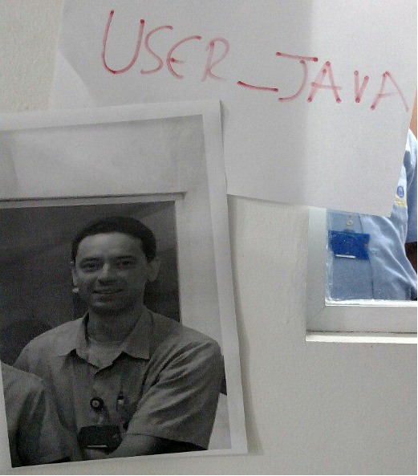

# Frases que marcaram a história do NTI

> *"Eu já peidei muito naquele courinho." (AUGUSTO, Thiago)*

> *"Deixa meu C de mão." - ([Cavalcanti, Igor][igor])*

> *"A Nubank tá roxa de raiva." ([MACIEL, Atmos][atmos])*

> *"Show de bolas!" - (Augusto, Thiago)*

> *"Meu plano para o ano que vem é deixar meu GitHub igual a Amazônia: cinza." ([MACIEL, Atmos][atmos])*

> *"Eu escolhi minha mãe." (GUIRALDELLI, William)*

> *"Malhar na academia é fácil, agora quero ver malhar na mangueira que nem eu..." ([CARLOS, Werliton][letox])*

> *"Eu vou ali tomar um leitinho batido." (AUGUSTO, Thiago)*

> *"O PHP tem muitos problemas, mas também muitas soluções." ([RODRIGUES, Fredson][fredson])*

> *"Eu já andei de ônibus mais de vinte vezes." (O RIQUINHO, Thiago)*

> *"Eu quero sentar e chorar um pouquinho." (CHORINHO, Thiago)*

> *"Mais rápido! Mais rápido!" ([RODRIGUES, Fredson][fredson])*

> *"Saaaaaaaiiii Tátiloooon! Saaaaaaaai Táaaatilonnn!" ([MACIEL, Atmos][atmos])*

> *"Quando virei, Tatilon tava cravado." - ([Cavalcanti, Igor][igor])*

> *"Bora Amauri! Mostra teu shape, porra!." - ([OLIVEIRA, Guilherme][guilherme])*

> *"Arão, Arão, Arão, Arão, Arão, Ê Arão, Arão, Arão, Arão. PORRA!" - (COLINS, Matteus)*

> *"Respinga aqui em mim..." - (AUGUSTO, Thiago)*

> *"... eu tentei te dar, mas tu não quis." - (MATTOS, Celso)*

> *"... eu vou é passar minhas férias em bariloche." - (O RIQUINHO, Thiago)*

> *"... vamos lá nós duas." - (A MENINA, Raul)*

> *"Eu vou ser a mulher de Thiago." - ([Cavalcanti, Igor][igor], vulgo Steffany)*

> *"Me chama de jumento vai... diz que eu sou um jumento..." - (Sales, Raul)*

> *"Eu estou malhando na Selfit porque lá tem banheiro masculino..." - (Lima, Bruno)*

> *"Tu quer que eu tire ou vire a casaca..." - (Sales, Raul)*

> *"Eu fui em um show dos Mamonas Assassinas" - (AUGUSTO, Thiago)*

> *"Werliton... o GRANDE." ([MACIEL, Atmos][atmos])*

> *".. Essa porra é boa!" (FARIAS, Arão)*

> *"Bota uma coisa maior aí." ([GULOSO, Atmos][atmos])*

> *"Arão, pode colocar aí: vou trocar com Bruno." (TROCADOR, Thiago)*

> *"Ai Celso me disse: Se tu der pra alguém eu vou trocar de novo!" (FARIAS, Arão)*

> *"...vamos lá nós duas." - (A MENINA, Raul)*

> *"...Chupa essa bala halls, Quirino" - (GUIRALDELLI, William)*

> *"...Hoje eu vou tomar aqui." - (GULOSO, Raul)*

[atmos]: https://github.com/atmosmps
[fredson]: https://github.com/fredsonrodrigues
[letox]: https://github.com/werliton
[igor]: https://github.com/cavalcantigor
[guilherme]: https://github.com/guilhermeof

### Regras para validação da Frase.

1. Tem que haver pelo menos uma testemunha da vergonha para confirmar a zueira ou o próprio indivíduo tem que confirmar.

    
    
<i>"Vem coisa boa por aí..."</i>

